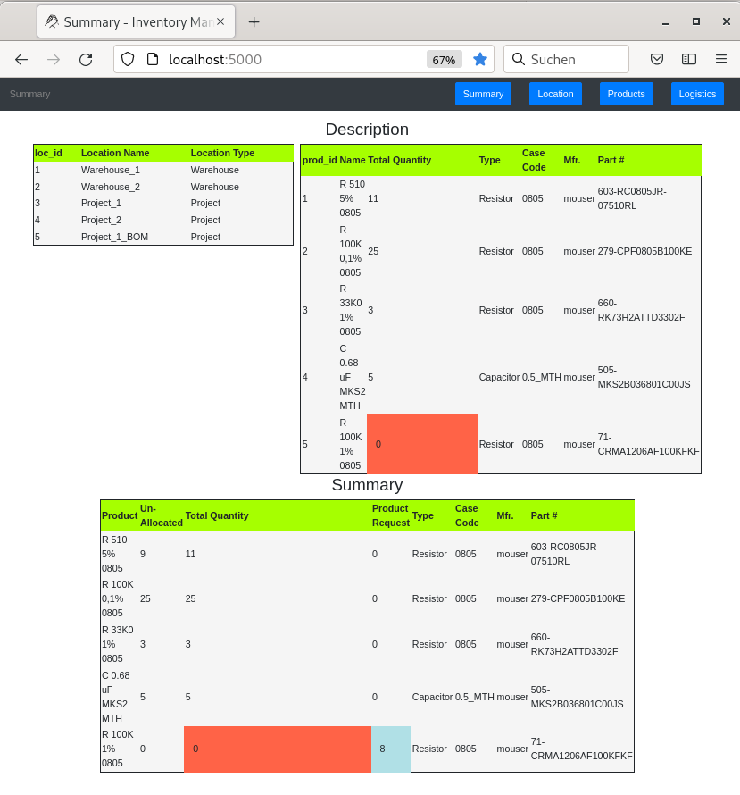
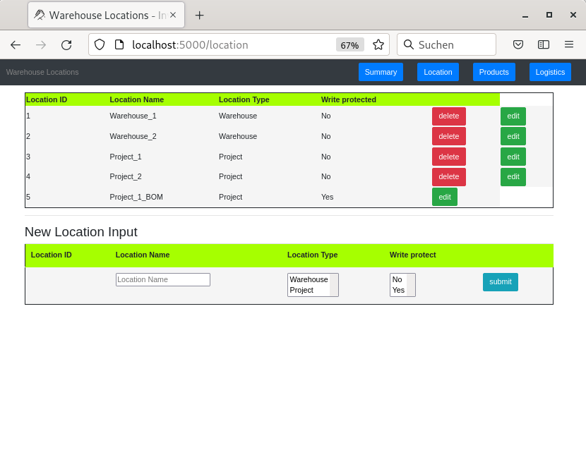
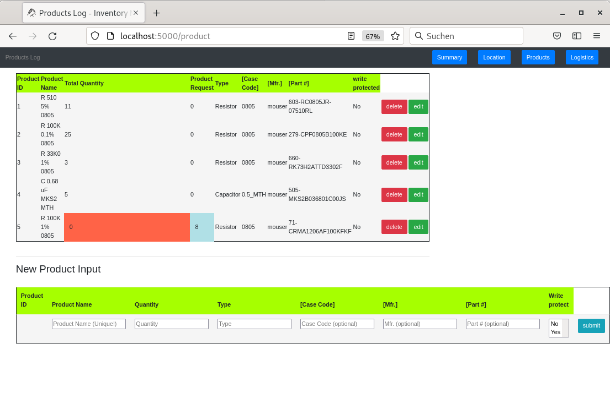
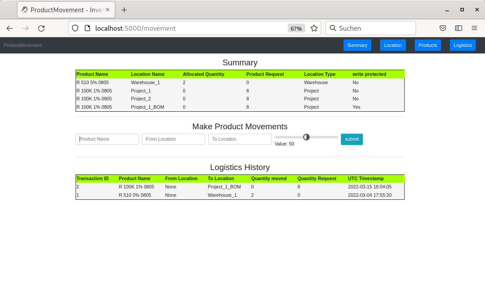

# Comments to this fork on Inventory Management System


## Table of Contents


- [Original Sources on github](https://github.com/gavindsouza/inventory-management-system)
- [Updates](#updates)
- [Presentation](#presentation)
- [Added handling](#added_handling)

## Updates<a name="updates"></a>

[2022-03-15] 

- extended 'Description' with: *Location Type (Warehouse/Project), Case Code, Manufacturer, and Part-Nunber*.
- extended 'Summary' with: *Product Request, Type, Case Code, Manufacturer, and Part-Nunber*.
- extended 'Warehouse Locations' with: *Location Type (Warehouse/Project) and Write protected*.
- extended 'Products' with: *Product Request, Type, Case Code, Manufacturer, Part-Nunber and Write protected*.
- extended 'ProductMovement-Summary' with: *Product Request, Location Type (Warehouse/Project) and write protected*.
- extended 'ProductMovement-Logistics History' with: *Named table-content instead of IDs*.
- coloured table-header sticky on the top.
- coloured current selected table-raw (hover).
- write protection selectable for *products* and *locations*.
- location type selectable '*Warehouse*' or '*Project*'.
- configuration-file 'inventory/config.py' added.
- start-script 'runinventory.sh' added.

## Presentation<a name="presentation"></a>

- Summary (default database)



<hr>

- Location (default database)



<hr>

- Products (default database)



<hr>

- Product Movement (default database)




## Added handling<a name="added_handling"></a>

- the application is startable now with script 'runinventory.sh'. Port- and host-numbers are changeable.

``` sourceCode console
 python3 -m flask run --port=5000 --host=0.0.0.0
```
 
- the configuration-file: *inventory/config.py* hold the information: database-name and secret-key. if required they can be changed.

``` sourceCode console
 SECRET_KEY='dev',
 DATABASE='inventory.sqlite',
```

- Product-moveing to **'Project'** -locations is possible now with higher quantity as 'Allocated'. This results in new 'Product Request' quantity.

- write protection is now selectable for *products* and *locations*. Deletion and adding data are then not possible for this product/location. Usable for Project-BOMs, common used products etc.

 